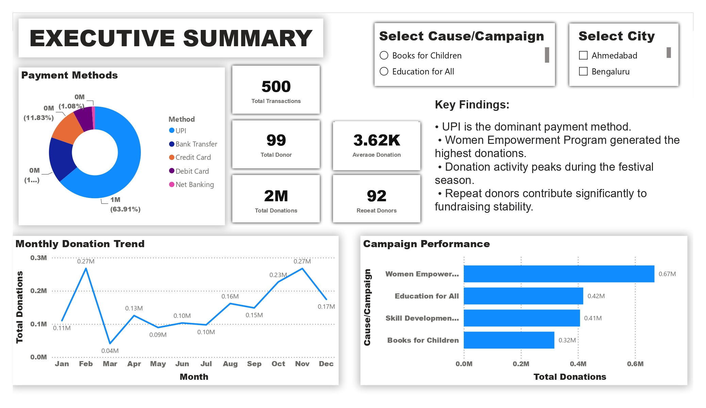
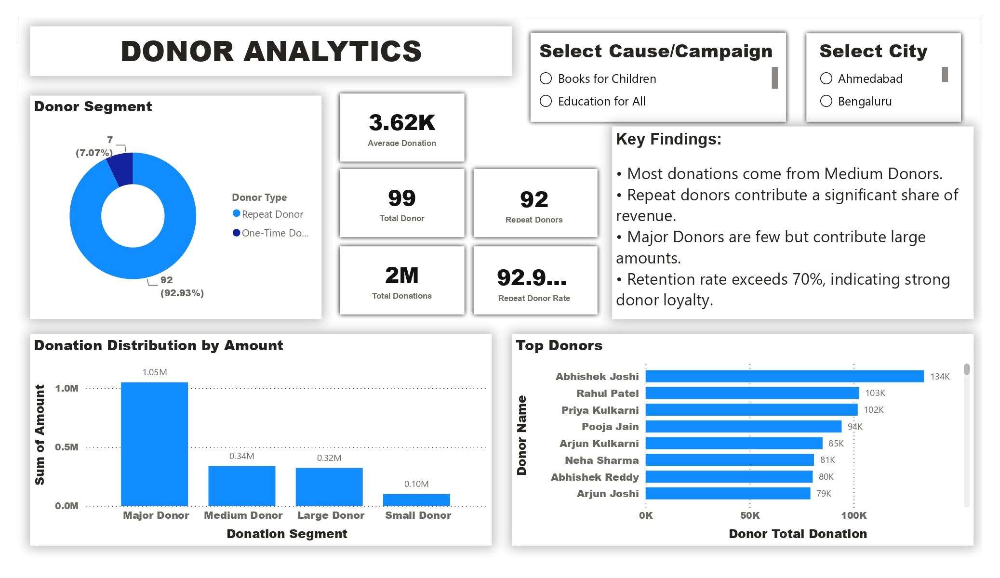
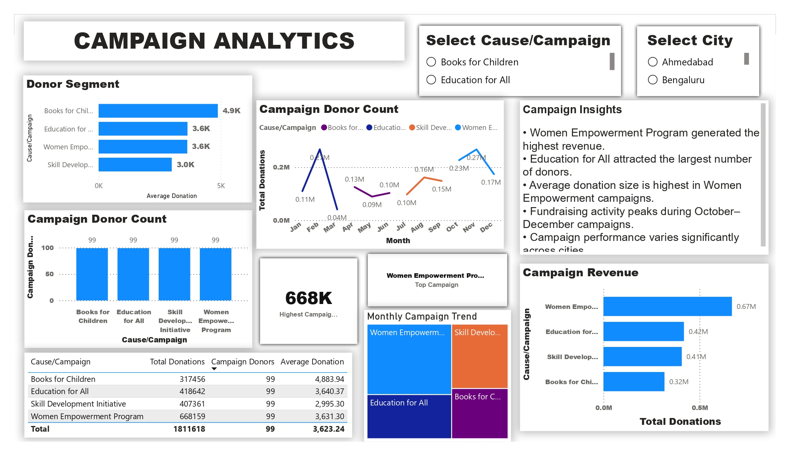
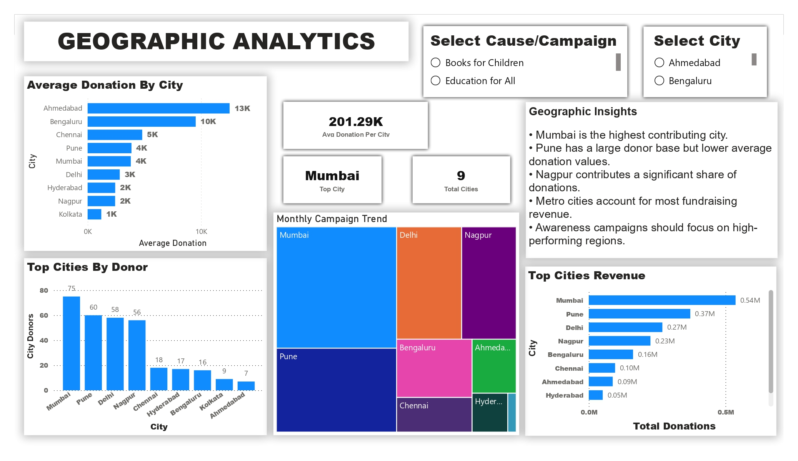
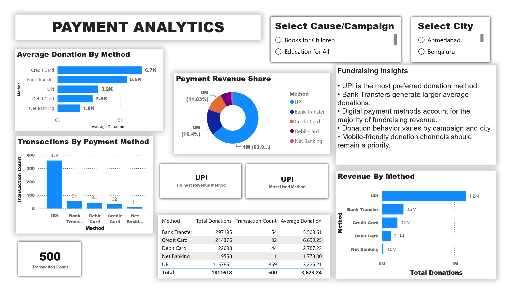

# NayePankh Foundation Donation Analytics Dashboard

## Project Overview

This project analyzes donation data for NayePankh Foundation using Power BI to provide insights into fundraising performance, donor behavior, campaign effectiveness, geographic contribution, and payment preferences.

The objective is to demonstrate how data analytics can help non-profit organizations make data-driven decisions and improve fundraising outcomes.

---

## Problem Statement

Non-profit organizations rely heavily on donations to support their social initiatives. Understanding donation trends, donor retention, campaign performance, and payment preferences is critical for sustainable fundraising.

This project answers key business questions such as:

* Which campaigns generate the highest revenue?
* Which cities contribute the most donations?
* How loyal are donors?
* Which payment methods are preferred?
* What fundraising strategies should be prioritized?

---

## Dataset Information

The dataset contains realistic NGO donation records with the following attributes:

| Column         | Description          |
| -------------- | -------------------- |
| Date           | Donation Date        |
| Donor Name     | Name of Donor        |
| Amount         | Donation Amount      |
| Phone          | Contact Number       |
| Email          | Donor Email          |
| Cause/Campaign | Fundraising Campaign |
| Method         | Payment Method       |
| City           | Donor City           |

### Dataset Summary

* 500 Donation Records
* 99 Unique Donors
* 4 Fundraising Campaigns
* 9 Cities
* 5 Payment Methods

---

## Tools Used

* Power BI
* Microsoft Excel
* DAX (Data Analysis Expressions)

---

## Dashboard Pages

### 1. Executive Summary

KPIs:

* Total Donations
* Total Donors
* Average Donation
* Repeat Donors
* Top Campaign
* Top City

---

### 2. Donor Analytics

Features:

* Top Donors
* Donor Segmentation
* Retention Analysis
* Donation Distribution

---

### 3. Campaign Analytics

Features:

* Campaign Revenue Analysis
* Campaign Donor Count
* Revenue Share
* Campaign Performance Trends

---

### 4. Geographic Analytics

Features:

* Donation Distribution by City
* Top Contributing Cities
* Geographic Revenue Analysis

---

### 5. Payment Analytics

Features:

* Revenue by Payment Method
* Transaction Analysis
* Payment Method Share
* Average Donation by Method

---

## Key Findings

* Women Empowerment Program generated the highest fundraising revenue.
* Mumbai emerged as the highest contributing city.
* UPI was the most preferred payment method.
* Repeat donors contributed significantly to total fundraising revenue.
* Metropolitan cities accounted for a major share of donations.

---

## Business Recommendations

1. Invest more resources in high-performing campaigns.
2. Improve donor retention programs.
3. Expand fundraising activities in top-performing cities.
4. Promote UPI-based donation channels.
5. Use data analytics for ongoing fundraising optimization.

---

## Project Screenshots

### Executive Summary

### Donor Analytics

### Campaign Analytics

### Geographic Analytics

### Payment Analytics

---

## Author

Pratik Manwatkar

B.Tech Data Science

Power BI | Data Analytics | Business Intelligence
